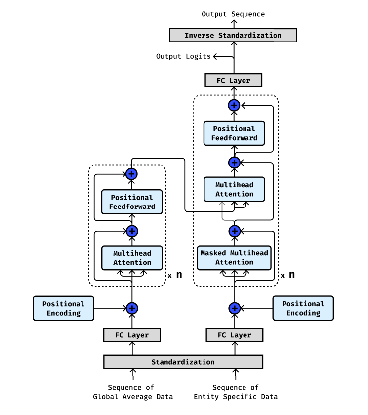

# Transformer For Time Series Data
This is an experimental project about implementation of transformer architecture for a time series data.

## Project Structure
```
./
├── .gitignore
├── README.md
├── architecture.png
│
├── data
│   ├──global-data-on-sustainable-energy.csv  -> Raw Dataset
│   └── cleaned_dataset.csv                   -> Cleaned Dataset (Used for training, val, and test)
│
├── Preprocessing.ipynb                   -> Preprocessing Code
├── gdp_per_capita_pred.ipynb             -> Model Code
│
└── transformer_architecture.py           -> Transformer Architecture from Scratch code
```

## Dataset
The dataset used is "Global Data on Sustainable Energy (2000-2020)" by Ansh Tanwar. This dataset contains energy and gdp data for around 173 countries accross 21 years.

The dataset can be accessed from this link: https://www.kaggle.com/datasets/anshtanwar/global-data-on-sustainable-energy

## Architecture
